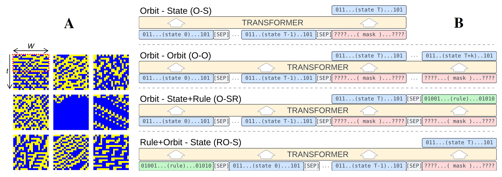
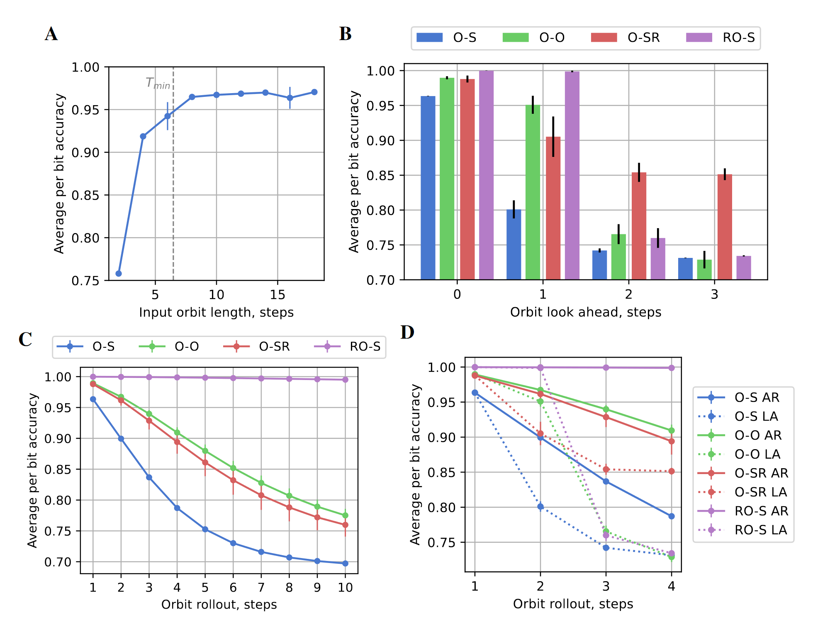
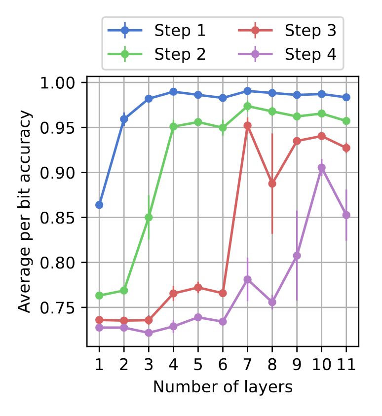

# Learning Elementary Cellular Automata with Transformers

Code for _Burtsev, Mikhail. "[Learning Elementary Cellular Automata with Transformers](https://openreview.net/forum?id=rROdzn4DSb)." In [The 4th Workshop on Mathematical Reasoning and AI at NeurIPS'24](https://mathai2024.github.io/)._

_Keywords_: Transformers, Elementary Cellular Automata, Rule Abstraction, Planning

**TL;DR**: Transformers can learn to generalize the local rules of Elementary Cellular Automata.

## Abstract:

Large Language Models demonstrate remarkable mathematical capabilities but at the same time struggle with abstract reasoning and planning. In this study, we explore whether Transformers can learn to abstract and generalize the rules governing Elementary Cellular Automata. By training Transformers on state sequences generated with random initial conditions and local rules, we show that they can generalize across different Boolean functions of fixed arity, effectively abstracting the underlying rules. While the models achieve high accuracy in next-state prediction, their performance declines sharply in multi-step planning tasks without intermediate context. Our analysis reveals that including future states or rule prediction in the training loss enhances the models' ability to form internal representations of the rules, leading to improved performance in longer planning horizons and autoregressive generation. Furthermore, we confirm that increasing the model's depth plays a crucial role in extended sequential computations required for complex reasoning tasks. This highlights the potential to improve LLM with inclusion of longer horizons in loss function, as well as incorporating recurrence and adaptive computation time for dynamic control of model depth.

Fig.1. **Learning Elementary Cellular Automata (ECA) with Transformers.** **A.** Examples of training samples. Orbit of ECA is a sequence of binary strings of size $W = 20$. First $k = 10$ states marked by red rectangle encode Transformer input. **B.** Given a part of the orbit Transformer with full attention learns to predict the next state (O-S), the next few steps (O-O), the next state and a rule (O-SR), or predict the next state given a rule and an orbit (RO-S).

Fig.2. **Transformer learns to predict the next state of ECA but struggles to plan ahead.** **A.** Accuracy of the next state prediction for ECA orbit with size 20 generated by Boolean function of 5 arguments for different input state lengths. **B.** Planning accuracy for different training settings (see the main text for details). **C.** Accuracy for autoregressive generation of ECA orbit. **D.** Comparison of autoregressive (AR) and look ahead (LA) predictions.

Fig.3. **Adding layers improves prediction of ECA orbit.** Accuracy of O-O training for different number of layers.

## Notebooks

Dataset generation: https://github.com/burtsev/TransformerECA/blob/main/1dCA.ipynb

Visualisation of samples from the dataset: https://github.com/burtsev/TransformerECA/blob/main/1dCA_data_viz.ipynb

Training for O-O task: https://github.com/burtsev/TransformerECA/blob/main/1dCA_O-O_ai4math.ipynb

Training for O-SR task: https://github.com/burtsev/TransformerECA/blob/main/1dCA_O-SR_ai4math.ipynb

Training for RO-S task: https://github.com/burtsev/TransformerECA/blob/main/1dCA_RO-S_ai4math.ipynb

Training for O-S look ahead (planing) task: https://github.com/burtsev/TransformerECA/blob/main/1dCA_O-S_LookAhead_ai4math.ipynb

## Dataset

### Main dataset 

https://huggingface.co/datasets/mbur/1dCA_r2s20T20

| Parameter         | Description                                |
|-------------------|--------------------------------------------|
| r (int): `2`    | The radius of the CA rule.                 |
| size W (int): `20` | The number of cells in the CA.             |
| T (int): `20`    | The number of steps for the CA to evolve.  |
| num_samples (int): `1000000` | The number of samples in the dataset. |

### Extra datasets

https://huggingface.co/datasets/mbur/1dCA_r3s20T20/

| Parameter         | Description                                |
|-------------------|--------------------------------------------|
| r (int): `3`    | The radius of the CA rule.                 |
| size W (int): `20` | The number of cells in the CA.             |
| T (int): `20`    | The number of steps for the CA to evolve.  |
| num_samples (int): `1111111` | The number of samples in the dataset. |

https://huggingface.co/datasets/mbur/1dCA_r4s20T20

| Parameter         | Description                                |
|-------------------|--------------------------------------------|
| r (int): `4`    | The radius of the CA rule.                 |
| size W (int): `20` | The number of cells in the CA.             |
| T (int): `20`    | The number of steps for the CA to evolve.  |
| num_samples (int): `1111111` | The number of samples in the dataset. |
